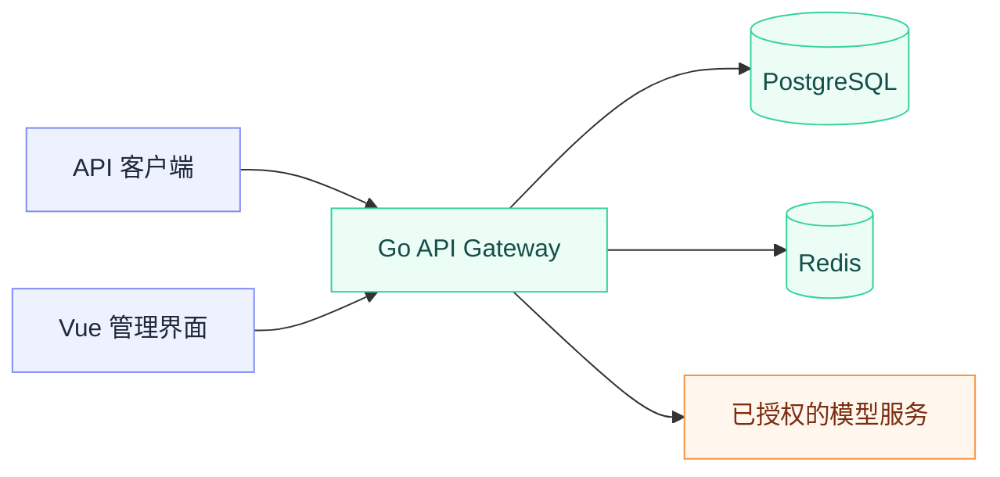

<div align="center">


# sub2apipro

Sub2API 维护副本 · AI API 网关与自托管部署。


[本仓库定位](#本仓库定位) · [部署与使用](#部署与使用) · [来源与差异](#来源与差异) · [原英文文档](./README_UPSTREAM.md) · [中文文档](./README_CN.md) · [日本語](./README_JA.md)

</div>

本仓库保留 Sub2API 项目的代码与文档，并承载本地维护改动。项目包含 Go 后端、Vue 前端、PostgreSQL 和 Redis 等组件，面向模型 API 接入与额度分配场景。

这里不是上游官方仓库，也不因仓库名包含 `pro` 就宣称具备额外的商业授权、服务保证或已经验收的企业级能力。

## 本仓库定位

| 范围 | 说明 |
| --- | --- |
| 上游项目 | [Wei-Shaw/sub2api](https://github.com/Wei-Shaw/sub2api) |
| 当前副本 | [alanbulan/sub2apipro](https://github.com/alanbulan/sub2apipro)，默认分支 `main` |
| 使用资料 | [中文](./README_CN.md)、[原英文](./README_UPSTREAM.md)、[日本語](./README_JA.md) |
| 本仓库变更 | [提交记录](https://github.com/alanbulan/sub2apipro/commits/main) |
| 许可与限制 | 保留仓库中的原有许可、署名和上游使用提示，不在本页重新授权 |

## 部署与使用

使用本副本时，克隆当前仓库，而不是无意间切换回上游源码：

```sh
git clone https://github.com/alanbulan/sub2apipro.git
cd sub2apipro
```

之后按照[中文部署文档](./README_CN.md)或[完整英文文档](./README_UPSTREAM.md)核对环境、安装方式、数据存储和配置。镜像、二进制、一键安装脚本可能指向上游发布渠道；使用前检查来源，不能假设它们包含本副本的独立修改。



该图说明组件关系，不是对生产可用性、吞吐量或账号安全的测试结论。接入凭据只应存放在适当的 Secret 或受保护配置中，不提交到 Git。

## 来源与差异

GitHub 是否显示 Fork 标记不能代替代码来源说明。本仓库的原 README 使用 Sub2API 名称，并指向上游项目；原有内容已完整保留在根目录的 [README_UPSTREAM.md](./README_UPSTREAM.md)，原相对链接的基准不变。

本次整理前，`main` 的提交为 `a93fa9d34d70032bab15089cab697803e7d39348`，其中记录了远程 ref 查询错误时保留同步检查点的修复。这个 SHA 是**本仓库整理前快照**，不是已经核实的上游同步基线。

不能把本副本描述为与上游零差异或实时同步。合并上游更新前应核对基线、独立提交、配置与数据库迁移，并保留回滚路径。

## 使用与验证边界

上游的重要提示仍然适用，包括服务条款风险、合规使用、责任声明和商业授权相关说明；完整措辞保留在[原文档](./README_UPSTREAM.md)。本页不改变这些条款，也不把原文档中的赞助、价格或推广内容作为本副本的质量证明。

本次仅整理文档与来源导航，没有修改 API、路由、计费、数据迁移、同步程序或供应商配置，也没有执行生产部署和模型调用验收。
