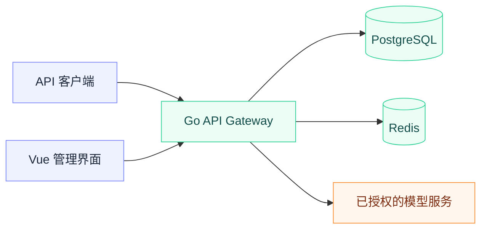

<div align="center">


# sub2apipro

Sub2API 维护副本 · AI API 网关与自托管部署。


[本仓库定位](#本仓库定位) · [部署与使用](#部署与使用) · [来源与差异](#来源与差异) · [原英文文档](./README_UPSTREAM.md) · [中文文档](./README_CN.md) · [日本語](./README_JA.md)

</div>

本仓库保留 Sub2API 项目的代码与文档，并承载本地维护改动。项目包含 Go 后端、Vue 前端、PostgreSQL 和 Redis 等组件，面向模型 API 接入与额度分配场景。

这里不是上游官方仓库，也不因仓库名包含 `pro` 就宣称具备额外的商业授权、服务保证或已经验收的企业级能力。

## 本仓库定位

| 范围 | 说明 |
| --- | --- |
| 当前上游 | [ranxi2001/sub2api](https://github.com/ranxi2001/sub2api)，生产分支 `production` |
| 当前副本 | [alanbulan/sub2apipro](https://github.com/alanbulan/sub2apipro)，默认分支 `main` |
| 使用资料 | [中文](./README_CN.md)、[原英文](./README_UPSTREAM.md)、[日本語](./README_JA.md) |
| 本仓库变更 | [提交记录](https://github.com/alanbulan/sub2apipro/commits/main) |
| 许可与限制 | 保留仓库中的原有许可、署名和上游使用提示，不在本页重新授权 |

## 部署与使用

使用本副本时，克隆当前仓库，而不是无意间切换回上游源码：

```sh
git clone https://github.com/alanbulan/sub2apipro.git
cd sub2apipro
```

## API Key 并发等待队列

当 API Key 设置了大于 `0` 的 `concurrency_limit` 时，达到上限后的新请求会在原连接上等待空闲槽位。默认值 `0` 不增加 Key 级并发限制。等待策略是全局配置，进程启动时读取：

```yaml
gateway:
  api_key_queue:
    max_waiting: 5
    timeout_seconds: 30
```

| 环境变量 | 默认值 | 说明 |
|----------|--------|------|
| `GATEWAY_API_KEY_QUEUE_MAX_WAITING` | `5` | 每个受限 Key 允许额外等待的请求数；`0` 关闭 Key 排队。 |
| `GATEWAY_API_KEY_QUEUE_TIMEOUT_SECONDS` | `30` | 单个请求最长等待秒数，必须为正整数。 |

- 等待名额按 Key 独立计算，不保证 FIFO；`concurrency_limit: 0` 的 Key 不进入队列。
- 队列用于 HTTP/SSE、OpenAI Responses WebSocket 每轮请求和 Live 创建的 Key 准入，与用户级、账号级等待限制独立。
- 等待期间复核 Key、用户及当前请求的模型/能力权限。Key 换组、平台或计费模式变化返回可重试的 `503` / `API_KEY_GROUP_CHANGED`。WebSocket 鉴权/权限失败以 `1008` 关闭，容量或临时服务错误以 `1013` 关闭。
- 关闭排队时达到上限返回 `429` / `gateway_concurrency_limit`；队列满返回 `429` / `api_key_queue_full`；等待超时返回 `429` / `api_key_queue_timeout`。
- 两个配置值必须为整数；负数、小数、非法字符串或超出范围会阻止启动。即使关闭排队，超时也必须为正数。
- 修改 Compose `.env` 后需要重建容器以更新环境变量。调大等待时间时，需要确认客户端及反向代理的首字节超时。
- 升级自动应用 `237_add_api_key_concurrency_limit.sql`，旧 Key 默认为 `0`。回退二进制不会撤销数据库新增字段。


之后按照[中文部署文档](./README_CN.md)或[完整英文文档](./README_UPSTREAM.md)核对环境、安装方式、数据存储和配置。镜像、二进制、一键安装脚本可能指向上游发布渠道；使用前检查来源，不能假设它们包含本副本的独立修改。


```mermaid
flowchart LR
    Client[API 客户端] --> Gateway[Go API Gateway]
    Admin[Vue 管理界面] --> Gateway
    Gateway --> DB[(PostgreSQL)]
    Gateway --> Cache[(Redis)]
    Gateway --> Provider[已授权的模型服务]
    classDef ui fill:#eef2ff,stroke:#818cf8,color:#1e293b
    classDef local fill:#ecfdf5,stroke:#34d399,color:#134e4a
    classDef remote fill:#fff7ed,stroke:#fb923c,color:#7c2d12
    class Client,Admin ui
    class Gateway,DB,Cache local
    class Provider remote
```

该图说明组件关系，不是对生产可用性、吞吐量或账号安全的测试结论。接入凭据只应存放在适当的 Secret 或受保护配置中，不提交到 Git。

## 来源与差异

GitHub 是否显示 Fork 标记不能代替代码来源说明。本仓库的原 README 使用 Sub2API 名称，并指向上游项目；原有内容已完整保留在根目录的 [README_UPSTREAM.md](./README_UPSTREAM.md)，原相对链接的基准不变。

本次整理前，`main` 的提交为 `a93fa9d34d70032bab15089cab697803e7d39348`，其中记录了远程 ref 查询错误时保留同步检查点的修复。这个 SHA 是**本仓库整理前快照**，不是已经核实的上游同步基线。

不能把本副本描述为与上游零差异或实时同步。合并上游更新前应核对基线、独立提交、配置与数据库迁移，并保留回滚路径。

## 使用与验证边界

上游的重要提示仍然适用，包括服务条款风险、合规使用、责任声明和商业授权相关说明；完整措辞保留在[原文档](./README_UPSTREAM.md)。本页不改变这些条款，也不把原文档中的赞助、价格或推广内容作为本副本的质量证明。

本次仅整理文档与来源导航，没有修改 API、路由、计费、数据迁移、同步程序或供应商配置，也没有执行生产部署和模型调用验收。
