# BeaconChip 员工使用手册

> **BeaconChip · API Gateway Platform**
> 公司统一的 AI 模型 API 中转平台。员工通过一个平台账号和若干 API 密钥，就可以在 Claude Code、Codex CLI、Gemini CLI、OpenCode 等工具中使用公司采购的 AI 模型。**推荐配合 CC Switch 使用，一键导入、无需手动改配置。**

| 项目 | 值 |
| --- | --- |
| 站点名称 | BeaconChip |
| 站点副标题 | API Gateway Platform |
| 控制台 / API 端点地址 | `https://api.beaconchip-token.com` |
| 适用对象 | 公司全体员工（普通用户角色） |

> 说明：本手册截图取自与生产环境配置一致的演示实例（站点名、副标题、API 端点相同），图中的账号、密钥、金额和用量都是演示数据。生产环境的侧边栏可能因管理员开启的功能不同而多出或少几个菜单（例如“充值/订单”“模型广场”“邀请返利”），操作方式相同。

---

## 目录

1. [快速上手（5 分钟）](#1-快速上手5-分钟)
2. [登录平台](#2-登录平台)
3. [仪表盘](#3-仪表盘)
4. [API 密钥管理](#4-api-密钥管理)
5. [在客户端中使用密钥](#5-在客户端中使用密钥)
6. [使用记录](#6-使用记录)
7. [我的订阅](#7-我的订阅)
8. [个人资料与账号安全](#8-个人资料与账号安全)
9. [API Key 用量查询（免登录）](#9-api-key-用量查询免登录)
10. [安全规范（必读）](#10-安全规范必读)
11. [常见问题与错误码](#11-常见问题与错误码)

---

## 1. 快速上手（5 分钟）

1. 打开 `https://api.beaconchip-token.com`，用管理员发给你的**邮箱 + 初始密码**登录，登录后先到“个人资料”修改密码。
2. 进入左侧 **API 密钥** → 点击右上角 **创建密钥**，选择厂商（如 Anthropic）和分组，填写名称后创建。
3. **推荐：** 在电脑上安装 **CC Switch**，然后在密钥列表点击 **导入到 CCS**，在 CC Switch 中确认并启用。这样不需要手动改任何配置文件（详见 [5.1](#51-推荐cc-switch-一键导入)）。
4. 不想装 CC Switch 时，也可以点击 **使用密钥**，按客户端和操作系统复制配置，粘贴到终端或配置文件中。
5. 重启 Claude Code / Codex 等客户端即可使用；在 **使用记录** / **仪表盘** 中随时查看自己的消耗。

> 💡 **首选 CC Switch**：一次导入、自动写好配置、一键切换、托盘里随时看余额。新同事按第 5.1 节操作，通常 2 分钟内就能用上。

---

## 2. 登录平台

访问 `https://api.beaconchip-token.com/login`：

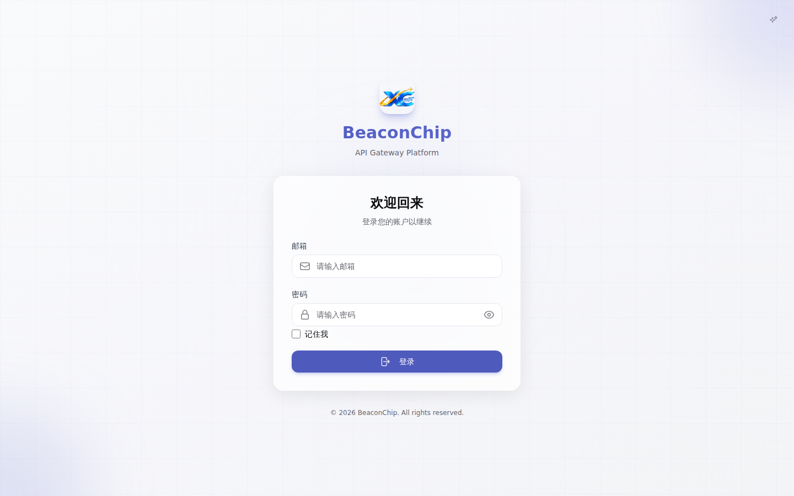

- **邮箱 / 密码**：账号由管理员统一开通，平台不开放自助注册。首次登录后请立即修改密码（见第 8 节）。
- **记住我**：在个人电脑上勾选后可保持较长时间的登录状态；在公共或共享电脑上**不要勾选**。
- 如果管理员开启了双因素认证（2FA）且你已绑定，登录时还需要输入认证器 App 中的 6 位验证码。
- 忘记密码：如果登录页有“忘记密码”入口，可通过邮箱重置；没有该入口时请联系管理员重置。

未登录时访问根地址会看到平台首页，点击 **立即开始** 或右上角 **登录** 进入登录页：

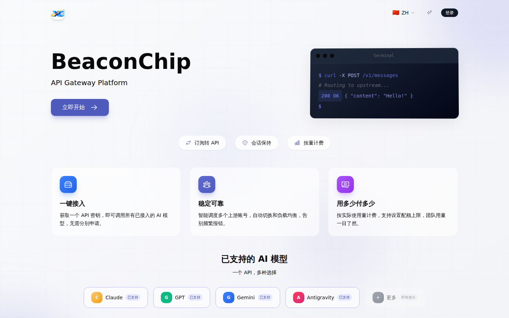

---

## 3. 仪表盘

登录后默认进入 **仪表盘**，它是你个人账户的总览。

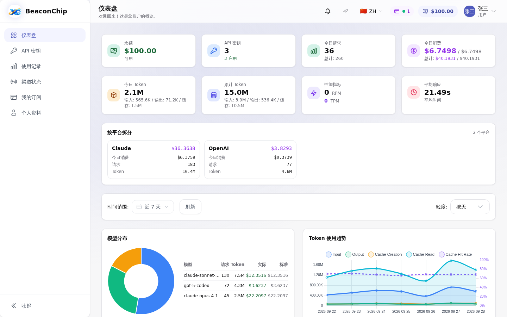

| 区域 | 说明 |
| --- | --- |
| 余额 | 当前账户可用余额（美元计价）。按量计费的分组从余额中扣费。 |
| API 密钥 | 你拥有的密钥数量及其中启用的数量。 |
| 今日请求 / 今日消费 | 今天的调用次数和费用；下方“总计”为累计值。 |
| 今日 Token / 累计 Token | 输入、输出、缓存 Token 的统计。 |
| 性能指标 | 当前 RPM（每分钟请求数）和 TPM（每分钟 Token 数）。 |
| 平均响应 | 请求的平均耗时。 |
| 按平台拆分 | 按 Claude、OpenAI 等平台拆分的费用、请求数和 Token。 |
| 模型分布 / Token 使用趋势 | 可切换时间范围（近 7 天等）和粒度（按天 / 按小时）。 |

右上角工具栏：

- **铃铛**：平台公告。
- **ZH / EN**：切换界面语言。
- **余额徽标**：随时显示当前余额。
- **头像菜单**：进入个人资料、退出登录。
- 左下角 **收起** 可折叠侧边栏。

---

## 4. API 密钥管理

左侧菜单 **API 密钥**。API 密钥（形如 `sk-xxxx…`）是客户端调用平台的凭证，每个密钥必须绑定一个**分组**，分组决定了能用哪些模型、走哪条线路以及计费倍率。

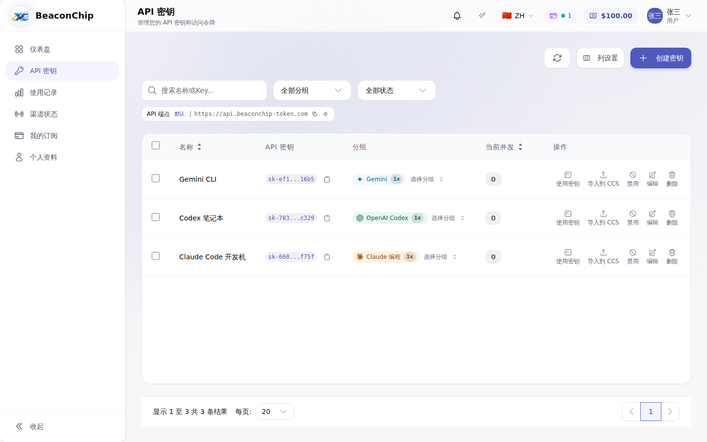

列表上方的 **API 端点** 就是客户端要填写的 Base URL：`https://api.beaconchip-token.com`，点击右侧图标可复制，闪电图标可测速。

### 4.1 创建密钥

点击右上角 **创建密钥**：

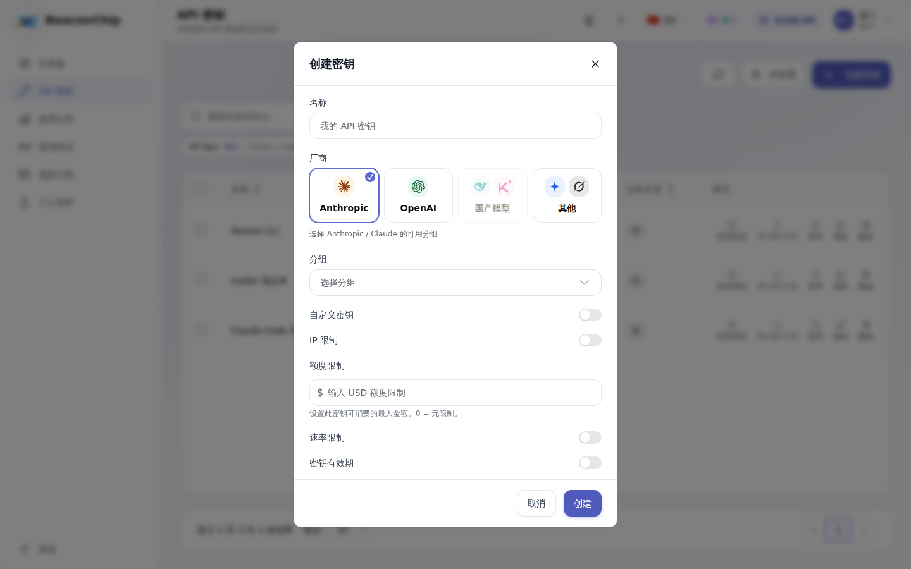

| 字段 | 说明 |
| --- | --- |
| 名称 | 建议写明用途和设备，例如 `Claude Code 开发机`、`Codex 笔记本`，便于在使用记录中区分。 |
| 厂商 | Anthropic（Claude）、OpenAI（GPT / Codex）、国产模型（DeepSeek、Kimi、智谱 GLM、MiniMax）、其他（Gemini、Grok、Antigravity、OpenCode、混合分组）。灰色表示当前没有你可用的分组。 |
| 分组 | 选择该厂商下你有权限的分组。分组名旁的 `1x` 等为计费倍率。 |
| 自定义密钥 | 一般不需要开启。开启后可自己指定密钥内容（至少 16 位，只能包含字母、数字、下划线、连字符）。 |
| IP 限制 | 可设置白名单 / 黑名单（每行一个 IP 或 CIDR）。设置白名单后只有这些 IP 能用此密钥，适合固定出口的服务器。 |
| 额度限制 | 此密钥最多可消费的金额（USD），`0` 或留空为不限制。建议给测试或共享给脚本的密钥设置额度。 |
| 速率限制 | 按 5 小时 / 1 天 / 7 天窗口限制该密钥的最大消费额。 |
| 密钥有效期 | 可设置到期时间，到期后密钥自动失效。 |

> 建议：**一个设备 / 一个用途一个密钥**。某台机器丢失或密钥泄露时，只需禁用那一个密钥，不影响其他工作。

### 4.2 密钥列表中的操作

| 操作 | 作用 |
| --- | --- |
| 复制图标 | 复制完整密钥。 |
| 分组 → 选择分组 | 直接点击分组列可更换分组（例如从 Claude 分组切换到另一个 Claude 分组），无需重建密钥。 |
| 使用密钥 | 弹出各客户端的配置示例，已自动填好端点和密钥（见第 5 节）。 |
| 导入到 CCS | ⭐ 一键导入到 CC Switch，推荐（见 5.1）。 |
| 禁用 / 启用 | 临时停用密钥，停用后调用会返回 `API_KEY_DISABLED`。 |
| 编辑 | 修改名称、IP 限制、额度、速率限制、有效期等；也可重置已用额度。 |
| 删除 | 永久删除密钥，不可恢复。 |

勾选多个密钥后可 **批量编辑**；**列设置** 可显示用量、额度、上次使用时间、最近使用 IP 等列。

密钥状态说明：**活跃**（正常）、**已停用**（手动禁用）、**额度耗尽**（达到额度限制）、**已过期**（超过有效期）。

---

## 5. 在客户端中使用密钥

有两种方式：

| 方式 | 适合谁 | 操作 |
| --- | --- | --- |
| ⭐ **CC Switch 一键导入（推荐）** | 所有人，特别是不熟悉命令行或经常在多个密钥 / 分组之间切换的同事 | 点击 **导入到 CCS** → 在 CC Switch 中确认 |
| 手动配置 | 服务器、CI、或不方便安装桌面软件的环境 | 点击 **使用密钥** → 复制环境变量 / 配置文件 |

### 5.1 推荐：CC Switch 一键导入

> ⭐ **强烈推荐所有员工使用 CC Switch。** 它是一个免费开源的桌面工具，专门用来管理 Claude Code、Codex、Gemini CLI 等 AI 编程工具的“供应商”配置。配合 BeaconChip 的 **导入到 CCS** 按钮，**无需打开终端、无需编辑任何配置文件**，点一下就能用。

**为什么特别方便**

- **一键导入**：点击“导入到 CCS”，端点 `https://api.beaconchip-token.com`、你的密钥、客户端类型全部自动带入，不会出现复制漏字符、多空格、写错文件位置等问题。
- **自动写好配置**：CC Switch 会替你写入 Claude Code 的 `~/.claude/settings.json`、Codex 的 `~/.codex/config.toml` / `auth.json` 等文件，你不用知道它们在哪。
- **一键切换**：可以同时保存多个供应商（例如 “BeaconChip-Claude” 与 “BeaconChip-Codex”，或不同分组的密钥），在主界面或系统托盘里点一下即可切换，重启客户端即生效。
- **余额随时可见**：平台导入时已预置用量查询脚本，CC Switch 会自动定期查询该密钥的**剩余额度**并显示出来，不用登录网页也能知道还剩多少。
- **跨平台**：支持 Windows、macOS、Linux。

**支持一键导入的分组类型**

| 密钥所在分组 | 导入到 CC Switch 的客户端 |
| --- | --- |
| Anthropic（Claude） | Claude Code |
| OpenAI（GPT / Codex） | Codex（默认模型 `gpt-5.5`） |
| Gemini | Gemini CLI |
| Antigravity | 点击后弹窗选择 Claude Code 或 Gemini CLI |
| Grok | Grok Build |

**操作步骤**

1. **安装 CC Switch**：从官方发布页 <https://github.com/farion1231/cc-switch/releases> 下载与你系统对应的安装包（Windows `.msi`、macOS `.dmg`、Linux `.AppImage` / `.deb`）并安装。安装后**至少打开一次**，让系统注册 `ccswitch://` 链接协议。
2. **在 BeaconChip 中导入**：登录平台 → 左侧 **API 密钥** → 找到要用的密钥，点击操作栏中的 **导入到 CCS**。

   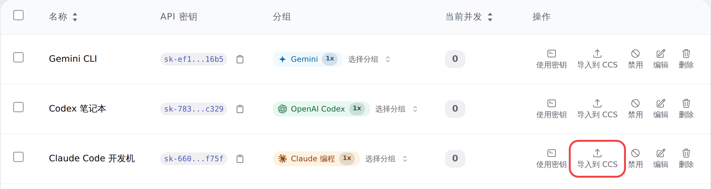

3. **允许打开 CC Switch**：浏览器弹出“是否打开 CC Switch”时，点击 **打开 / 允许**（可勾选“始终允许”，以后不再询问）。
4. **在 CC Switch 中确认**：CC Switch 会弹出导入确认，供应商名称为 **BeaconChip**，核对端点为 `https://api.beaconchip-token.com` 后点击确认。
5. **启用供应商**：在 CC Switch 对应的应用页签（Claude / Codex / Gemini）中，把 **BeaconChip** 设为当前启用的供应商。
6. **重启客户端**：关闭并重新打开 Claude Code / Codex / Gemini CLI（已打开的终端窗口请新开一个），即可开始使用。

**小技巧**

- 为 Claude 和 Codex 分别创建密钥并分别导入，CC Switch 中会各有一条 BeaconChip 供应商，互不干扰。
- 更换密钥（例如旧密钥被禁用）后，只需对新密钥再点一次“导入到 CCS”，然后在 CC Switch 中切换到新条目，删除旧条目即可。
- 导入后请**不要**再手动修改 `~/.claude/settings.json` 等文件，统一交给 CC Switch 管理，避免配置被覆盖。

**常见问题**

- 点击后页面提示“**CC-Switch 未安装或协议处理程序未注册**”：说明本机没有安装 CC Switch，或安装后从未打开过。安装并打开一次后重试；仍不行请重启浏览器。
- 浏览器没有任何反应：检查是否误点了“始终阻止”，在浏览器的站点设置中允许 `ccswitch` 外部协议后重试。
- 公司电脑无法安装软件：请改用下面 5.2–5.5 节的手动配置方式，或联系 IT 协助安装。

---

以下为**手动配置方式**。在密钥列表点击 **使用密钥**，平台会根据密钥所在分组显示可用的客户端页签，并自动填好端点 `https://api.beaconchip-token.com` 和你的密钥。**推荐直接从弹窗复制**，下面的内容用于理解每个配置的作用，示例中的 `sk-你的密钥` 请替换为自己的密钥。

### 5.2 Claude Code 手动配置（Anthropic 分组）

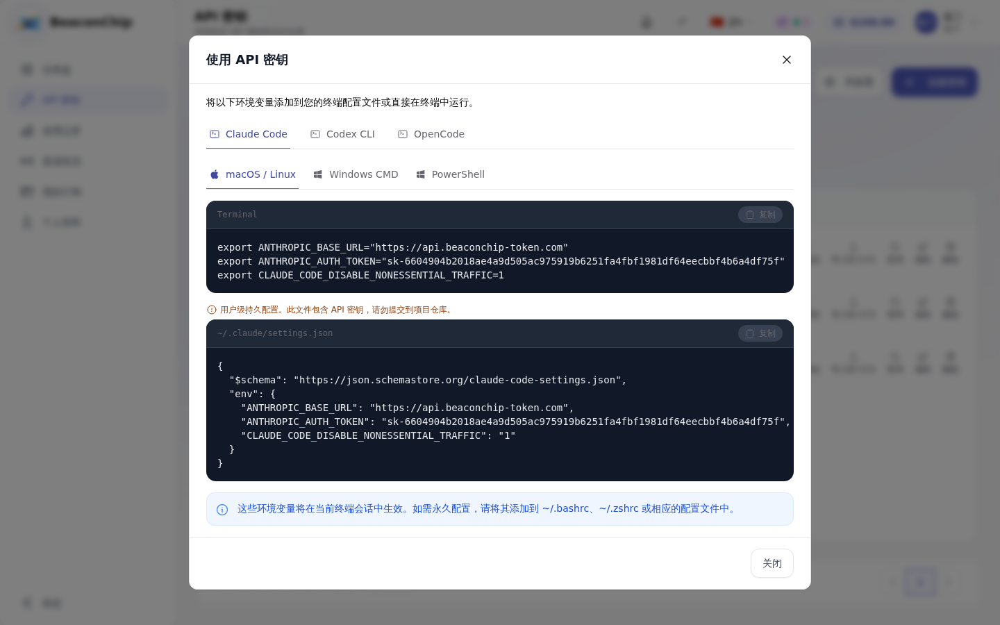

**方式一：终端环境变量（仅当前终端会话生效）**

macOS / Linux：

```bash
export ANTHROPIC_BASE_URL="https://api.beaconchip-token.com"
export ANTHROPIC_AUTH_TOKEN="sk-你的密钥"
export CLAUDE_CODE_DISABLE_NONESSENTIAL_TRAFFIC=1
```

Windows CMD：

```bat
set ANTHROPIC_BASE_URL=https://api.beaconchip-token.com
set ANTHROPIC_AUTH_TOKEN=sk-你的密钥
set CLAUDE_CODE_DISABLE_NONESSENTIAL_TRAFFIC=1
```

Windows PowerShell：

```powershell
$env:ANTHROPIC_BASE_URL="https://api.beaconchip-token.com"
$env:ANTHROPIC_AUTH_TOKEN="sk-你的密钥"
$env:CLAUDE_CODE_DISABLE_NONESSENTIAL_TRAFFIC="1"
```

如需永久生效，把 `export` 这几行追加到 `~/.bashrc` 或 `~/.zshrc`。

**方式二：用户级配置文件（推荐，持久生效）**

编辑 `~/.claude/settings.json`（Windows 为 `%USERPROFILE%\.claude\settings.json`）：

```json
{
  "$schema": "https://json.schemastore.org/claude-code-settings.json",
  "env": {
    "ANTHROPIC_BASE_URL": "https://api.beaconchip-token.com",
    "ANTHROPIC_AUTH_TOKEN": "sk-你的密钥",
    "CLAUDE_CODE_DISABLE_NONESSENTIAL_TRAFFIC": "1"
  }
}
```

保存后重新运行 `claude` 即可。

> ⚠️ `settings.json` 含有密钥，**绝不要**放进项目目录的 `.claude/` 或提交到 Git 仓库，只能放在用户主目录下。

### 5.3 Codex CLI 手动配置（OpenAI 分组）

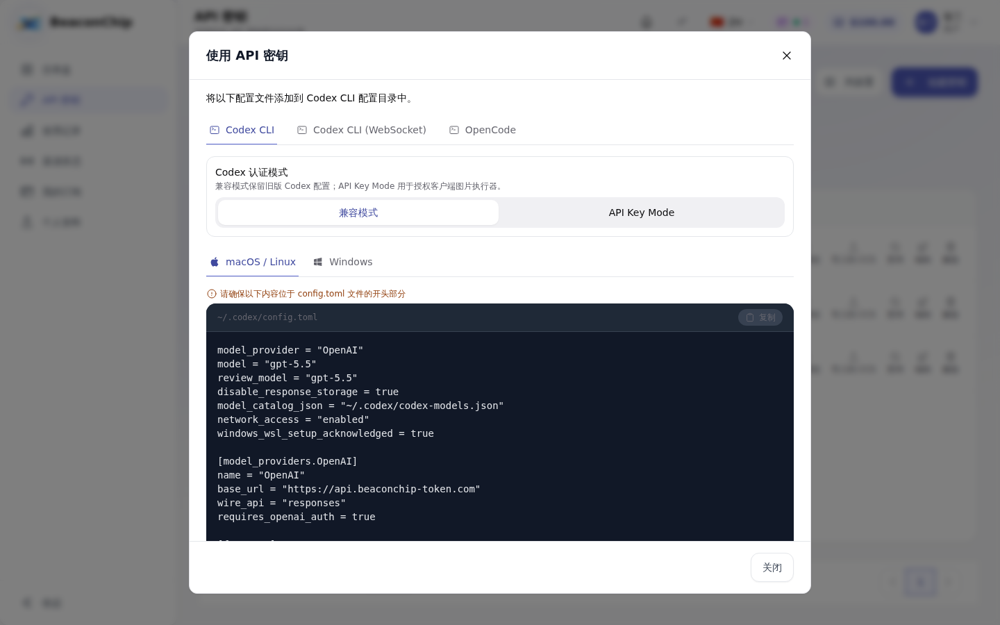

1. 创建配置目录：macOS / Linux 执行 `mkdir -p ~/.codex`；Windows 按 `Win+R` 输入 `%userprofile%\.codex`（不存在就手动创建）。
2. 在弹窗中选择 **Codex 认证模式**：
   - **兼容模式**（默认，适合大多数人）：需要 `config.toml` + `auth.json` 两个文件。
   - **API Key Mode**：只需 `config.toml`，用于需要客户端图片执行器的场景。保存后必须**完全退出并重启** Codex Desktop / CLI，再新建 task。
3. 将弹窗中的 `config.toml` 内容放到文件**开头**，兼容模式下再保存 `auth.json`。其核心内容如下（模型名以弹窗为准）：

```toml
model_provider = "OpenAI"
model = "gpt-5.5"
review_model = "gpt-5.5"
disable_response_storage = true
network_access = "enabled"

[model_providers.OpenAI]
name = "OpenAI"
base_url = "https://api.beaconchip-token.com"
wire_api = "responses"
requires_openai_auth = true
```

`~/.codex/auth.json`：

```json
{
  "OPENAI_API_KEY": "sk-你的密钥"
}
```

4. 部分分组的弹窗中会有 **Codex 模型目录**：点击“获取目录”→“下载目录”，把文件保存到 `config.toml` 中 `model_catalog_json` 指向的位置，然后重启 Codex。
5. 如果网络对 WebSocket 不友好，可改用 **Codex CLI (WebSocket)** 页签中的配置对比调整。

### 5.4 Gemini CLI 手动配置（Gemini 分组）

```bash
export GOOGLE_GEMINI_BASE_URL="https://api.beaconchip-token.com"
export GEMINI_API_KEY="sk-你的密钥"
export GEMINI_MODEL="gemini-2.0-flash"   # 以弹窗中的推荐模型为准
```

### 5.5 OpenCode 及其他工具

- **OpenCode**：在弹窗的 OpenCode 页签复制 `opencode.json`，保存到 `~/.config/opencode/opencode.json`（没有则新建），也可在客户端内用 `/connect` 命令填写密钥。
- **国产模型 / Grok / 混合分组**：弹窗会根据分组显示 Claude Code、Codex、OpenCode、Grok CLI 等对应的配置，照抄即可。
- **其他支持自定义 Base URL 的工具或 SDK**：
  - Anthropic 协议：Base URL 填 `https://api.beaconchip-token.com`，密钥填 `sk-…`。
  - OpenAI 协议：Base URL 填 `https://api.beaconchip-token.com/v1`，密钥填 `sk-…`。

### 5.6 连通性自测

```bash
# Anthropic 协议（Claude 分组的密钥）
curl https://api.beaconchip-token.com/v1/messages \
  -H "x-api-key: sk-你的密钥" \
  -H "anthropic-version: 2023-06-01" \
  -H "content-type: application/json" \
  -d '{"model":"claude-sonnet-4-5","max_tokens":64,"messages":[{"role":"user","content":"ping"}]}'

# OpenAI 协议（OpenAI 分组的密钥）：列出可用模型
curl https://api.beaconchip-token.com/v1/models \
  -H "Authorization: Bearer sk-你的密钥"
```

返回 JSON 结果即说明配置正确；若返回错误，请对照第 11 节排查。

---

## 6. 使用记录

左侧菜单 **使用记录**，查看每一次调用的明细与统计。

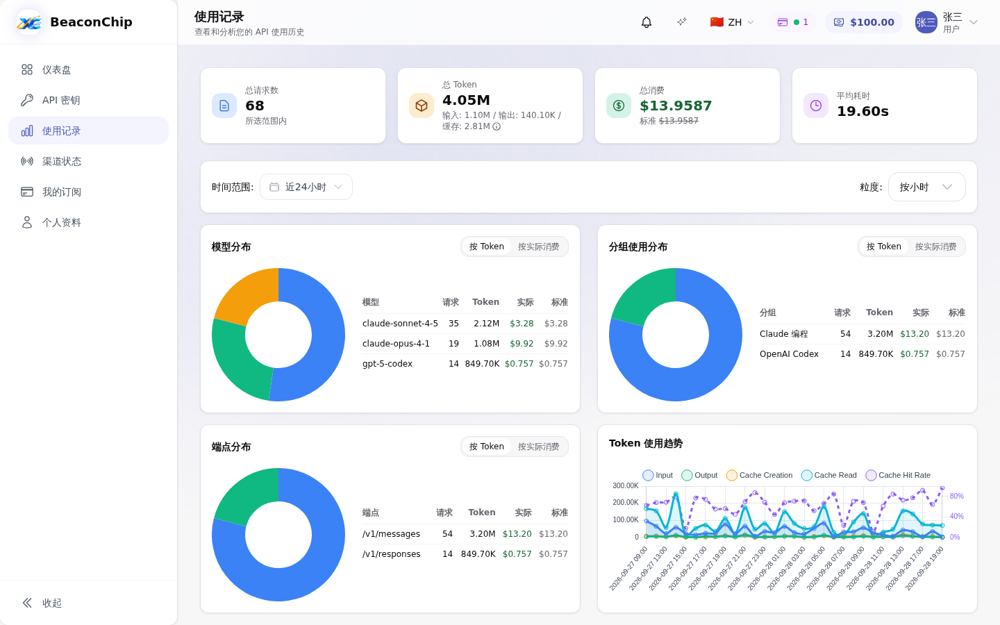

- 顶部卡片：所选时间范围内的总请求数、总 Token、总消费（**实际**为实际扣费，**标准**为原价）和平均耗时。
- **时间范围 / 粒度**：可选近 24 小时、近 7 天、自定义等。
- **模型分布 / 分组使用分布 / 端点分布**：可在“按 Token”和“按实际消费”之间切换。

向下滚动是逐条的调用明细：

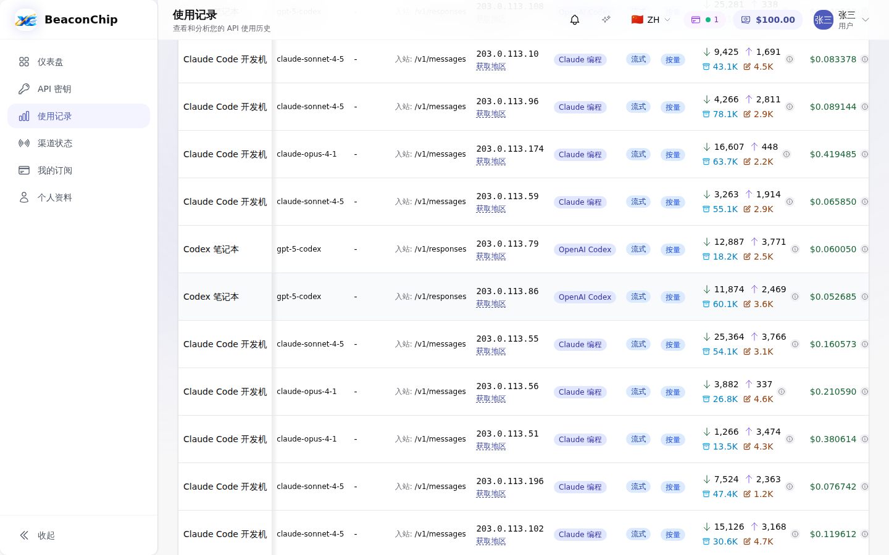

每一行包含：使用的密钥名称、模型、端点、来源 IP、分组、流式/同步、输入/输出/缓存 Token、费用。将鼠标悬停在费用或 Token 旁的 ⓘ 图标上可查看单价与费用构成。

- 可按 **API 密钥**、模型、时间等筛选。
- 支持 **导出 CSV / Excel**，便于报销或核对。
- **错误请求** 页签列出失败的请求及错误分类（认证失败、限流、余额/订阅、上游错误等），排查问题时很有用。

---

## 7. 我的订阅

如果管理员为你分配了订阅套餐（例如按月的 Claude 额度），可以在 **我的订阅** 查看：

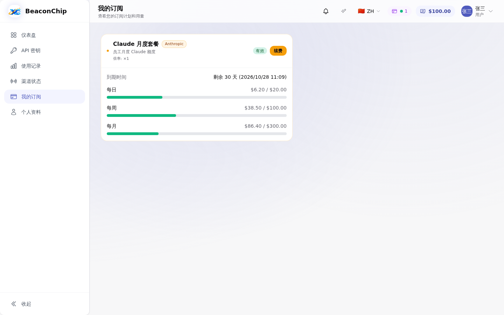

- 显示套餐名称、平台、倍率、到期时间及剩余天数。
- **每日 / 每周 / 每月** 进度条表示当前周期已用额度与上限，周期到期后自动重置。
- 订阅型分组的密钥**从订阅额度中扣费，不消耗余额**；额度用完后需等待周期重置，或联系管理员。
- 没有订阅时页面显示“暂无有效订阅”，属正常情况——你的密钥将按余额计费。

---

## 8. 个人资料与账号安全

点击左侧 **个人资料** 或右上角头像进入。

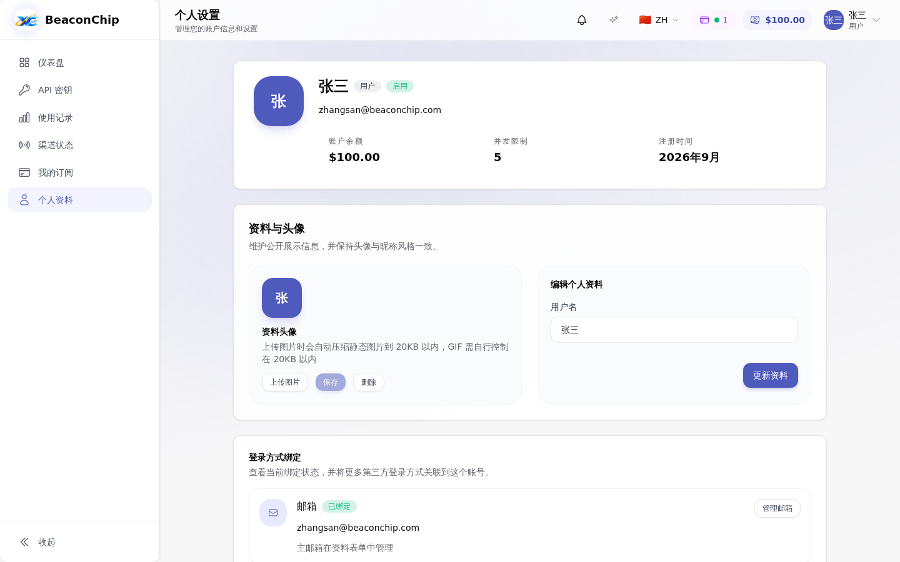

- **账户总览**：余额、并发限制（同时进行的请求数上限）、注册时间。
- **资料与头像**：修改用户名、上传头像。
- **登录方式绑定**：查看绑定的邮箱；若管理员开启了钉钉 / 企业 SSO 等第三方登录，可在此绑定。
- **修改密码**：首次登录后务必修改，密码至少 8 位。
- **双因素认证（2FA）**：若已开放，强烈建议使用 Google Authenticator、Microsoft Authenticator 等 App 开启。
- **Passkey**：若已开放，可用面容 ID / 触控 ID / Windows Hello 免密登录。
- **余额不足提醒**：开启后，余额低于阈值时会发邮件提醒你。

---

## 9. API Key 用量查询（免登录）

访问 `https://api.beaconchip-token.com/key-usage`，输入某个 API 密钥即可查看它的余额、今日 / 累计 Token 与费用、按日明细和按模型统计，**无需登录**。适合在服务器或同事协助排查时快速确认某个密钥的消耗。密钥只在浏览器本地处理，不会被保存。

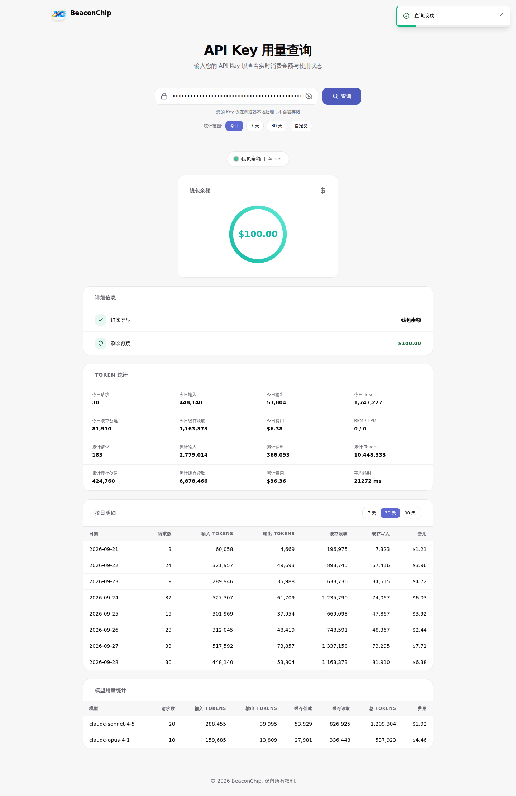

---

## 10. 安全规范（必读）

1. **密钥等同于账号余额**：任何拿到密钥的人都能用你的额度调用模型，所有消耗记在你名下。
2. **禁止**把密钥提交到 Git 仓库、贴到聊天群、工单、截图或公开文档中。`~/.claude/settings.json`、`~/.codex/auth.json` 只能放在个人主目录。
3. **一设备一密钥**，并为脚本 / 服务器上的密钥设置**额度限制**或 **IP 白名单**。
4. 离职、换电脑或怀疑泄露时，立即在“API 密钥”中**禁用或删除**对应密钥，再新建一个。
5. 不要把平台账号或密钥转借给他人；如需给同事开通，请联系管理员。
6. 平台仅用于工作用途，请遵守公司信息安全与数据合规要求，不要向模型发送客户隐私数据、密码等敏感信息。

---

## 11. 常见问题与错误码

### 11.1 常见错误码

| HTTP 状态 / 错误码 | 含义 | 处理方法 |
| --- | --- | --- |
| 401 `API_KEY_REQUIRED` | 请求没带密钥 | 检查环境变量 / 配置文件是否生效（新开一个终端再试）。 |
| 401 `INVALID_API_KEY` | 密钥错误或已删除 | 重新从“API 密钥”复制完整密钥，注意不要多复制空格。 |
| 401 `API_KEY_DISABLED` | 密钥已被禁用 | 在密钥列表中重新启用，或联系管理员。 |
| 403 `API_KEY_EXPIRED` | 密钥已过期 | 编辑密钥延长有效期，或新建密钥。 |
| 403 `ACCESS_DENIED` | 当前 IP 不在白名单 / 在黑名单中 | 编辑密钥的 IP 限制。 |
| 403 `INSUFFICIENT_BALANCE` | 余额不足 | 联系管理员充值。 |
| 403 `SUBSCRIPTION_NOT_FOUND` | 分组是订阅型，但你没有有效订阅 | 换到按量分组，或联系管理员开通订阅。 |
| 403 `GROUP_NOT_ALLOWED` / `GROUP_DISABLED` | 分组已无权限或被停用 | 在密钥列表中点击分组更换为可用分组。 |
| 429 `API_KEY_QUOTA_EXHAUSTED` | 达到密钥额度 / 速率限制 | 编辑密钥调整或重置额度，或等待时间窗口重置。 |
| 429（其他） | 并发数或上游限流 | 降低并发、稍后重试；持续出现请联系管理员。 |
| 429 `INVALID_AUTH_RATE_LIMITED` | 短时间内多次使用错误密钥 | 修正密钥后稍等片刻再试。 |
| 5xx | 上游或平台临时故障 | 稍后重试；持续出现请在“使用记录 → 错误请求”中找到记录后反馈管理员。 |

### 11.2 FAQ

**Q：配置客户端最简单的方式是什么？**  
A：安装 **CC Switch**，在“API 密钥”页点击 **导入到 CCS**，在 CC Switch 中确认并启用即可，无需手动编辑任何文件。详见 5.1 节。

**Q：配置好了，Claude Code 仍要求我登录 Anthropic 账号？**  
A：说明环境变量没有生效。确认 `~/.claude/settings.json` 中的 `env` 配置正确，或在同一终端里 `echo $ANTHROPIC_BASE_URL` 检查；然后完全退出 Claude Code 重新打开。

**Q：“使用密钥”弹窗提示“请先分配分组”？**  
A：密钥还没有绑定分组。在列表的“分组”列点击“选择分组”完成分配即可。

**Q：Codex 报 401 或提示需要登录？**  
A：兼容模式下需要同时有 `config.toml` 和 `auth.json`，且 `config.toml` 中 `model_provider` 那一段必须位于文件开头；修改后需完全重启 Codex。

**Q：同一个密钥能在多台电脑上用吗？**  
A：技术上可以，但不推荐。多设备共用会让使用记录难以区分，泄露后也难以定位。请每台设备单独创建密钥。

**Q：“标准”费用和“实际”费用有什么区别？**  
A：“标准”是按官方价格计算的原价，“实际”是乘以分组倍率后真正从余额 / 订阅中扣除的金额。

**Q：余额或订阅额度快用完了怎么办？**  
A：在“个人资料”开启余额不足提醒；需要追加额度时联系管理员。

**Q：哪些模型可以用？**  
A：取决于你可访问的分组。创建密钥时每个厂商下列出的就是你能用的分组；具体模型以“使用记录”与客户端的模型列表为准，如需开通新的模型或分组请联系管理员。

---

*如有其他问题，请联系 BeaconChip 平台管理员。*
